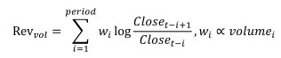
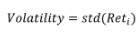
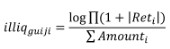
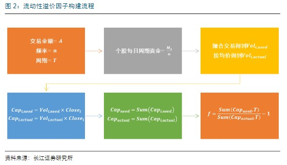
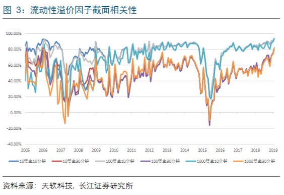
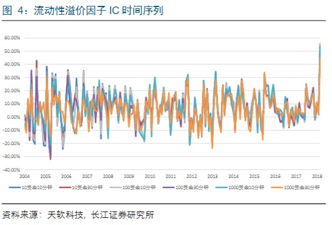
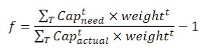
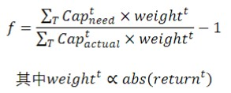

# 高频数据的微观划分
## 区分不同交易性质时间段：成交量大的普遍呈反转效应，成交量小的呈动量效应，日度数据无法反映这种关系，因为日度数据无法区分知情者和非知情者交易。
1. 成交量相对较大的时段大概率有知情者参与到交易中;
2. 知情者交易时段越多，股价波动更高，风险溢价更高，统计显示，波峰计数越大。
3. 因子综合，标准为，在成交量划分下，是否因子在各组的表现有显著差异，若有显著差异，说明有信息增量。那么，成交量划分下，各因子重新定义如下：
   (1) 反转因子
       
       全市场和中证800的整体组和异常组反转效应明显，正常组无效；风格剥离后，反转因子效果有所减弱，但正常因子会展现出弱动量特征；
       策略上，可以用风格剥离前的异常组和风格剥离后的正常组取差集，同时做空指数。
   (2) 波动因子
       
       风格剥离前信息区分度更高，且异常组和整体组中波动最大组收益较低，可用做风控判断，正常组波动较大组排除不掉。
       异常组整体上区分度优于正常组，但不足以说明是个优质因子。
   (3) 流动性因子
       
       流动性因子剥离后的最大组被加强了，风格剥离前最大组收益率有35%，线性下降至0。
   (4) 上述三个因子，全市场比中证800好很多。
## 高频交易因子分类：
1. 低风险确定性收益，核心逻辑是"反常"，通常是市场相关因子(可以类似理解为量价因子)，即个股局部异常现象，无其他较大问题时，该因子可以提供稳定收益。
   该类因子包括反转因子、波动率因子；
2. 高风险高溢价收益，核心逻辑是"风险溢价"，通常是个股相关因子(可以类似理解为基本面因子)，该类因子反映个股的固有风险，投资者会要求更高的风险溢价。
   代表因子流动性因子、波峰计数因子。
3. 两类因子的区别是因子衰减速度。反转因子和流动性因子在整体、正常、异常区间内分别均为第一类因子和第二类因子；
   而波动率因子在在异常区间表现为第一类因子，在正常区间表现为第二类因子，在整体区间表现介于第一类和第二类因子。

## 直接根据交易活跃度划分比区分行情上下行和市场整体活跃时间段两种间接的划分方式在反转和波动率因子上表现更好。

## 当同划分逻辑在因子改进上呈现相反结果时，表示某种划分下有信息增量

[//]: # (厨房瓷砖空鼓，飘窗破损，卫浴间玻璃门养水，客厅顶棚波浪纹，厨房空气能面板无法使用)

# 高频因子研究框架
## 三类因子：
1. 高频数据高频用
2. 高频数据低频用——之新因子构建(主要是盘口因子)
3. 高频数据高频用——之新因子构建(主要是风格因子的结构改进，或者高频因子和低频因子的结合，有限)

# 高频因子一：流动性溢价因子
## 因子构建
1. 用买卖价差描述流动性溢价
2. 高频流动性溢价因子构建

## 因子性质
1. 流动性溢价因子应当和传统的流动性因子呈负相关
2. 一方面，小市值股票流动性差，所以可以获得更高的流动性溢价，即因子应当和规模因子呈负相关；
   `流动性溢价因子和换手率因子呈负相关关系，随交易金额的增加，线性相关性的水平在提高，即交易金额越大，模拟订单越多，流动性溢价的估算水平越高，误差越大。`
   另一方面，同样流动性的股票市值较大的会分配更多的资金，在模拟撮合时会用到更多的模拟订单数据，流动性溢价更高。
   `流动性溢价因子和市值之间整体呈负向关系，即市值越小流动性溢价越高，但总体来说影响不大。`
3. 因子统计
因子的截面相关性

因子IC

4. 因子半衰期
## 因子测试
整体上
## 因子改进
流动性溢价的衰减速度较快。

溢价在价格变化较大时得到体现。

